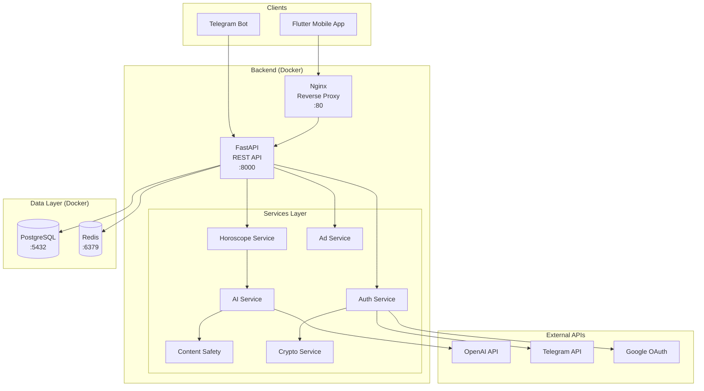
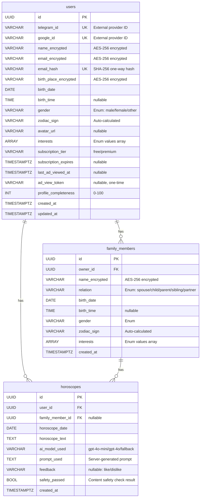
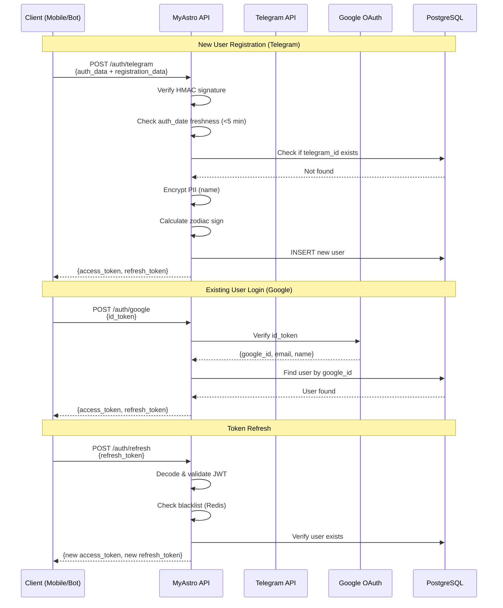
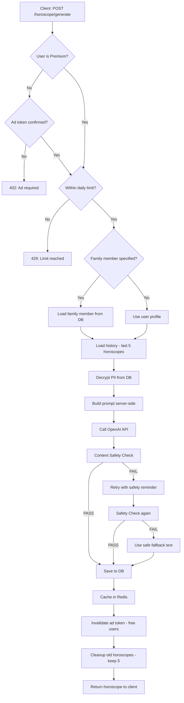
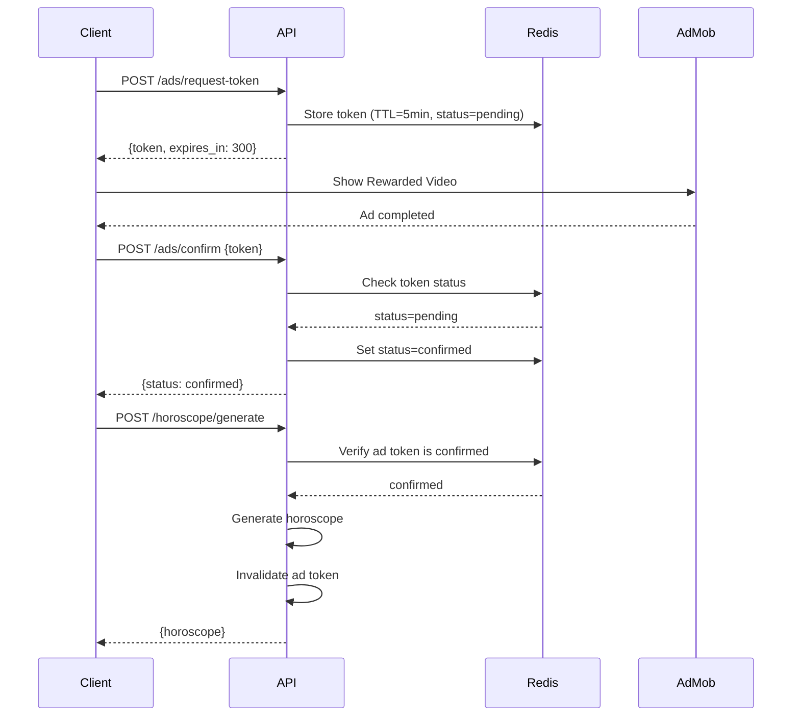
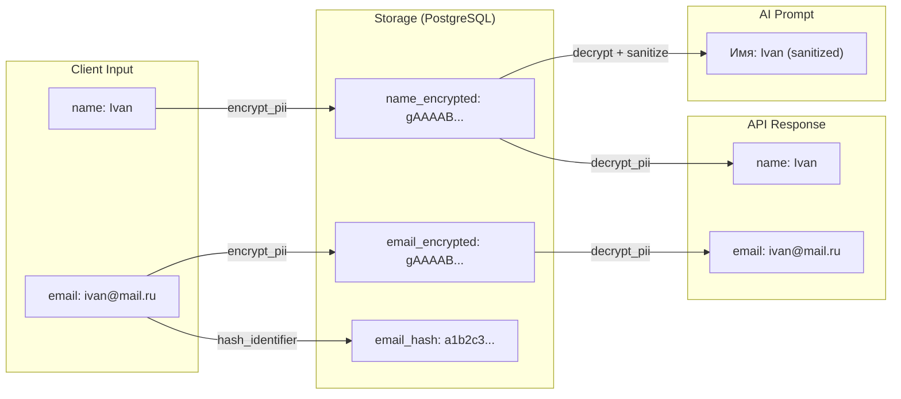
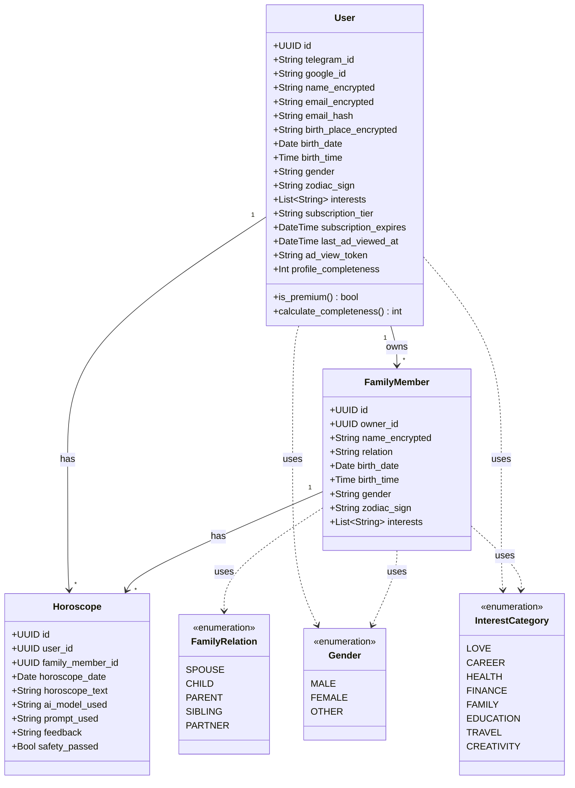
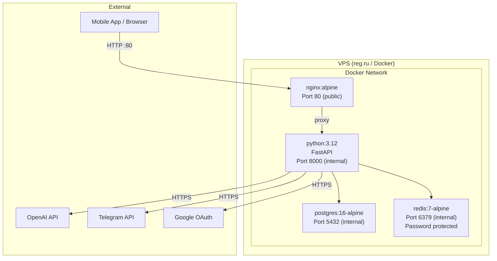

# MyAstro Backend -- System Documentation

**Version:** 0.1.0 (MVP)
**Last updated:** 2026-04-28
**Author:** Development Team

---

## Table of Contents

1. [System Overview](#1-system-overview)
2. [Architecture](#2-architecture)
3. [Database Schema](#3-database-schema)
4. [Authentication & Authorization](#4-authentication--authorization)
5. [Role Model](#5-role-model)
6. [API Reference](#6-api-reference)
7. [Business Logic](#7-business-logic)
8. [UML Diagrams](#8-uml-diagrams)
9. [Security Model](#9-security-model)

---

## 1. System Overview

MyAstro -- AI-powered персонализированный гороскоп-сервис. Генерирует ежедневные гороскопы на основе профиля пользователя и истории обратной связи. Работает через мобильное приложение (Flutter) и Telegram бота.

### Key Features

| Feature | Free | Premium |
|---|---|---|
| Daily horoscope | Yes (after ad) | Yes (no ads) |
| AI model | GPT-4o-mini | GPT-4o |
| Daily limit | 3 | 20 |
| Family members | 0 | Up to 5 |
| Feedback system | Yes | Yes |
| History (last 5) | Yes | Yes |

### Tech Stack

- **Runtime:** Python 3.12
- **Framework:** FastAPI (async)
- **Database:** PostgreSQL 16
- **Cache:** Redis 7
- **AI:** OpenAI GPT-4o-mini / GPT-4o
- **Auth:** JWT (access + refresh tokens)
- **Encryption:** AES-256 (Fernet) for PII
- **Deploy:** Docker Compose + Nginx

---

## 2. Architecture

### Component Diagram



### Project Structure

```
app/
├── api/                    # HTTP endpoints (routers)
│   ├── ads.py              # Ad verification endpoints
│   ├── auth.py             # Authentication endpoints
│   ├── horoscope.py        # Horoscope generation/feedback
│   └── profile.py          # User profile & family members
├── core/                   # Infrastructure layer
│   ├── config.py           # Settings (env vars)
│   ├── crypto.py           # PII encryption/decryption
│   ├── database.py         # SQLAlchemy async engine
│   ├── redis.py            # Redis client, rate limiting, caching
│   └── security.py         # JWT, auth verification, sanitization
├── models/                 # SQLAlchemy ORM models
│   ├── horoscope.py        # Horoscope model
│   └── user.py             # User, FamilyMember models + enums
├── schemas/                # Pydantic request/response models
│   ├── auth.py             # Auth request/response schemas
│   ├── horoscope.py        # Horoscope schemas
│   └── user.py             # Profile schemas + predefined options
├── services/               # Business logic
│   ├── ad_service.py       # Ad token management
│   ├── ai_service.py       # OpenAI prompt building & generation
│   ├── auth_service.py     # Registration & login logic
│   ├── content_safety.py   # Output safety filtering
│   ├── horoscope_service.py # Generation orchestration
│   └── zodiac_service.py   # Zodiac sign calculation
└── main.py                 # FastAPI app entry point
```

---

## 3. Database Schema

### ER Diagram



### Table: `users`

| Column | Type | Constraints | Description |
|---|---|---|---|
| id | UUID | PK, auto | Unique user identifier |
| telegram_id | VARCHAR(64) | UNIQUE, nullable | Telegram user ID (external) |
| google_id | VARCHAR(128) | UNIQUE, nullable | Google user ID (external) |
| name_encrypted | VARCHAR(500) | NOT NULL | User name, AES-256 encrypted |
| email_encrypted | VARCHAR(500) | nullable | Email, AES-256 encrypted |
| email_hash | VARCHAR(64) | UNIQUE, nullable | SHA-256 hash for lookups |
| birth_place_encrypted | VARCHAR(500) | nullable | Birth place, encrypted |
| birth_date | DATE | NOT NULL | Birth date (for zodiac calc) |
| birth_time | TIME | nullable | Birth time (for ascendant) |
| gender | VARCHAR(20) | NOT NULL | `male`, `female`, or `other` |
| zodiac_sign | VARCHAR(20) | NOT NULL | Auto-calculated from birth_date |
| avatar_url | VARCHAR(500) | nullable | Profile picture URL |
| interests | ARRAY(VARCHAR) | nullable | From InterestCategory enum |
| subscription_tier | VARCHAR(20) | DEFAULT 'free' | `free` or `premium` |
| subscription_expires | TIMESTAMPTZ | nullable | Premium expiry datetime |
| last_ad_viewed_at | TIMESTAMPTZ | nullable | Last ad view timestamp |
| ad_view_token | VARCHAR(64) | nullable | One-time ad completion token |
| profile_completeness | INT | DEFAULT 0 | 0-100% completion score |
| created_at | TIMESTAMPTZ | NOT NULL | Registration timestamp |
| updated_at | TIMESTAMPTZ | NOT NULL | Last update timestamp |

### Table: `family_members`

| Column | Type | Constraints | Description |
|---|---|---|---|
| id | UUID | PK, auto | Member identifier |
| owner_id | UUID | FK -> users.id | Parent user |
| name_encrypted | VARCHAR(500) | NOT NULL | Encrypted name |
| relation | VARCHAR(20) | NOT NULL | FamilyRelation enum |
| birth_date | DATE | NOT NULL | For zodiac calculation |
| birth_time | TIME | nullable | Optional |
| gender | VARCHAR(20) | NOT NULL | Gender enum |
| zodiac_sign | VARCHAR(20) | NOT NULL | Auto-calculated |
| interests | ARRAY(VARCHAR) | nullable | InterestCategory enum values |
| created_at | TIMESTAMPTZ | NOT NULL | Creation timestamp |

### Table: `horoscopes`

| Column | Type | Constraints | Description |
|---|---|---|---|
| id | UUID | PK, auto | Horoscope identifier |
| user_id | UUID | FK -> users.id | Owner user |
| family_member_id | UUID | FK -> family_members.id, nullable | If for family member |
| horoscope_date | DATE | NOT NULL, indexed | Target date |
| horoscope_text | TEXT | NOT NULL | Generated horoscope content |
| ai_model_used | VARCHAR(50) | NOT NULL | AI model identifier |
| prompt_used | TEXT | NOT NULL | Server-built prompt (for debug) |
| feedback | VARCHAR(20) | nullable | `like`, `dislike`, or NULL |
| safety_passed | BOOL | DEFAULT true | Content safety check result |
| created_at | TIMESTAMPTZ | NOT NULL | Generation timestamp |

### Predefined Enums

**InterestCategory** (users can ONLY select from this list):

| Value | Display (RU) |
|---|---|
| love | Любовь и отношения |
| career | Карьера и работа |
| health | Здоровье |
| finance | Финансы |
| family | Семья |
| education | Образование и развитие |
| travel | Путешествия |
| creativity | Творчество |

**Gender:** `male`, `female`, `other`

**FamilyRelation:** `spouse`, `child`, `parent`, `sibling`, `partner`

**Feedback:** `like`, `dislike`

---

## 4. Authentication & Authorization

### Auth Flow



### JWT Token Structure

**Access Token** (15 min TTL):
```json
{
  "sub": "user-uuid",
  "exp": 1714322400,
  "type": "access",
  "jti": "unique-token-id"
}
```

**Refresh Token** (30 days TTL):
```json
{
  "sub": "user-uuid",
  "exp": 1716914400,
  "type": "refresh",
  "jti": "unique-token-id"
}
```

### Security Measures

- Telegram auth: HMAC-SHA256 verification + auth_date freshness (max 5 min)
- Google auth: Token verification via Google's tokeninfo endpoint
- JWT: `jti` claim for token revocation via Redis blacklist
- No auth credentials stored in DB (only external provider IDs)
- Constant-time HMAC comparison (prevents timing attacks)

---

## 5. Role Model

### User Roles

| Role | Description | Capabilities |
|---|---|---|
| **Anonymous** | No token | Can only access: `GET /health`, `POST /auth/*` |
| **Free User** | `subscription_tier = "free"` | Generate horoscope (after ad), feedback, profile, view history. No family members. |
| **Premium User** | `subscription_tier = "premium"`, `subscription_expires > now` | All free features + no ads + better AI model + family members (up to 5) + higher daily limit |

### Permission Matrix

| Endpoint | Anonymous | Free | Premium |
|---|---|---|---|
| POST /auth/telegram | Yes | Yes | Yes |
| POST /auth/google | Yes | Yes | Yes |
| POST /auth/refresh | Yes | Yes | Yes |
| GET /profile/me | - | Yes | Yes |
| PATCH /profile/me | - | Yes | Yes |
| GET /profile/options | - | Yes | Yes |
| GET /profile/completeness | - | Yes | Yes |
| GET /profile/family | - | Yes (empty) | Yes |
| POST /profile/family | - | Denied (403) | Yes (up to 5) |
| DELETE /profile/family/:id | - | Denied | Yes |
| POST /ads/request-token | - | Yes | Not needed (400) |
| POST /ads/confirm | - | Yes | Not needed |
| POST /horoscope/generate | - | Yes (after ad) | Yes (direct) |
| GET /horoscope/today | - | Yes | Yes |
| GET /horoscope/history | - | Yes | Yes |
| POST /horoscope/:id/feedback | - | Yes | Yes |

---

## 6. API Reference

### Base URL

```
http://{host}/api/v1
```

All authenticated endpoints require header:
```
Authorization: Bearer {access_token}
```

---

### 6.1 Authentication

#### POST /auth/telegram

Authenticate or register via Telegram Login.

**Request Body:**
```json
{
  "auth_data": {
    "id": 123456789,
    "first_name": "Ivan",
    "last_name": "Petrov",
    "username": "ivanp",
    "photo_url": "https://t.me/i/userpic/...",
    "auth_date": 1714320000,
    "hash": "abc123def456..."
  },
  "registration_data": {
    "name": "Ivan",
    "birth_date": "1995-03-15",
    "gender": "male"
  }
}
```

`registration_data` is required only for new users. For existing users, omit it.

**Response (200):**
```json
{
  "access_token": "eyJhbGciOiJIUzI1NiIs...",
  "refresh_token": "eyJhbGciOiJIUzI1NiIs...",
  "token_type": "bearer"
}
```

**Errors:**
- 400: Invalid Telegram auth data / Registration data required

**Logic:**
1. Verify HMAC signature against bot token
2. Check auth_date is within 5 minutes
3. Look up user by telegram_id
4. If new: validate registration_data, encrypt PII, calculate zodiac, create user
5. Return JWT token pair

---

#### POST /auth/google

Authenticate or register via Google Sign-In.

**Request Body:**
```json
{
  "auth_data": {
    "id_token": "eyJhbGciOiJSUzI1NiIs..."
  },
  "registration_data": {
    "name": "Ivan",
    "birth_date": "1995-03-15",
    "gender": "male"
  }
}
```

**Response (200):** Same as Telegram auth.

**Logic:**
1. Verify id_token with Google's tokeninfo API
2. Check aud matches our client ID
3. Look up user by google_id
4. If new: same as Telegram flow

---

#### POST /auth/refresh

Refresh expired access token.

**Request Body:**
```json
{
  "refresh_token": "eyJhbGciOiJIUzI1NiIs..."
}
```

**Response (200):** New token pair.

**Errors:**
- 401: Invalid/expired token, token blacklisted, user not found

---

### 6.2 Profile

#### GET /profile/me

Get current user's profile (PII decrypted).

**Response (200):**
```json
{
  "id": "a1b2c3d4-...",
  "name": "Ivan",
  "birth_date": "1995-03-15",
  "gender": "male",
  "zodiac_sign": "Рыбы",
  "birth_time": "14:30",
  "birth_place": "Moscow",
  "email": "ivan@example.com",
  "avatar_url": "https://...",
  "interests": ["love", "career", "health"],
  "subscription_tier": "free",
  "subscription_expires": null,
  "is_premium": false,
  "family_members_count": 0,
  "family_members_limit": 0,
  "profile_completeness": 60,
  "created_at": "2026-04-28T12:00:00Z"
}
```

---

#### PATCH /profile/me

Update profile fields (progressive completion).

**Request Body** (all fields optional):
```json
{
  "name": "Ivan Petrov",
  "birth_time": "14:30",
  "birth_place": "Moscow",
  "email": "ivan@example.com",
  "interests": ["love", "career", "finance"]
}
```

**Validation Rules:**
- `name`: 2-100 characters
- `birth_time`: HH:MM format, 00:00-23:59
- `birth_place`: max 200 characters
- `email`: valid email format, max 255 characters
- `interests`: array of InterestCategory enum values only

**Response (200):** Updated UserProfile.

**Errors:**
- 400: Invalid input (format, length, enum value)

**Logic:**
1. Validate each provided field
2. Encrypt PII fields before storage
3. For interests: filter to only valid enum values
4. Recalculate profile_completeness
5. Return updated profile (decrypted)

---

#### GET /profile/options

Get predefined values for dropdown fields.

**Response (200):**
```json
{
  "interests": [
    {"value": "love", "label_ru": "Любовь и отношения"},
    {"value": "career", "label_ru": "Карьера и работа"},
    {"value": "health", "label_ru": "Здоровье"},
    {"value": "finance", "label_ru": "Финансы"},
    {"value": "family", "label_ru": "Семья"},
    {"value": "education", "label_ru": "Образование и развитие"},
    {"value": "travel", "label_ru": "Путешествия"},
    {"value": "creativity", "label_ru": "Творчество"}
  ],
  "genders": [
    {"value": "male", "label_ru": "Мужской"},
    {"value": "female", "label_ru": "Женский"},
    {"value": "other", "label_ru": "Другой"}
  ],
  "relations": [
    {"value": "spouse", "label_ru": "Супруг(а)"},
    {"value": "child", "label_ru": "Ребенок"},
    {"value": "parent", "label_ru": "Родитель"},
    {"value": "sibling", "label_ru": "Брат/Сестра"},
    {"value": "partner", "label_ru": "Партнер"}
  ]
}
```

---

#### GET /profile/completeness

Get profile completion status and hints.

**Response (200):**
```json
{
  "completeness": 60,
  "missing_fields": ["birth_time", "birth_place"],
  "hint_message": "Укажи время рождения для расчета асцендента"
}
```

---

#### GET /profile/family

List family members.

**Response (200):**
```json
[
  {
    "id": "f1e2d3c4-...",
    "name": "Maria",
    "relation": "spouse",
    "birth_date": "1997-07-22",
    "birth_time": null,
    "gender": "female",
    "zodiac_sign": "Рак",
    "interests": ["love", "health"],
    "created_at": "2026-04-28T15:00:00Z"
  }
]
```

---

#### POST /profile/family

Add a family member (Premium only).

**Request Body:**
```json
{
  "name": "Maria",
  "relation": "spouse",
  "birth_date": "1997-07-22",
  "gender": "female",
  "birth_time": "08:15",
  "interests": ["love", "health"]
}
```

**Response (201):** FamilyMemberResponse.

**Errors:**
- 403: Free users cannot add family members
- 400: Limit reached (max 5 for premium)

---

#### DELETE /profile/family/{member_id}

Delete a family member.

**Response:** 204 No Content.

---

### 6.3 Ads (Free Users)

#### POST /ads/request-token

Request a one-time ad viewing token.

**Response (200):**
```json
{
  "token": "a1b2c3d4e5f6...",
  "expires_in_seconds": 300
}
```

**Errors:**
- 400: Premium users don't need ad tokens

---

#### POST /ads/confirm

Confirm ad was watched.

**Request Body:**
```json
{
  "token": "a1b2c3d4e5f6..."
}
```

**Response (200):**
```json
{
  "status": "confirmed",
  "message": "Ad verified. You can now generate a horoscope."
}
```

**Errors:**
- 400: Invalid or expired token

---

### 6.4 Horoscope

#### POST /horoscope/generate

Generate a personalized horoscope. User has NO text input.

**Request Body** (optional):
```json
{
  "target_date": "2026-04-28",
  "family_member_id": "f1e2d3c4-..."
}
```

Both fields are optional. Defaults: today's date, self (not family member).

**Response (200):**
```json
{
  "id": "h1g2f3e4-...",
  "horoscope_date": "2026-04-28",
  "horoscope_text": "Дорогой Иван, сегодня звезды благоволят тебе в сфере карьеры...",
  "ai_model_used": "gpt-4o-mini",
  "feedback": null,
  "safety_passed": true,
  "family_member_id": null,
  "created_at": "2026-04-28T12:00:00Z"
}
```

**Errors:**
- 402: Ad viewing required (free user without confirmed ad token)
- 429: Daily limit reached
- 400: Invalid date / family member not found

**Logic:**



---

#### GET /horoscope/today

Get today's horoscope if already generated.

**Query Params:** `?family_member_id=uuid` (optional)

**Response (200):** HoroscopeResponse or `null`.

---

#### GET /horoscope/history

Get last 5 horoscopes with feedback.

**Query Params:** `?family_member_id=uuid` (optional)

**Response (200):**
```json
{
  "horoscopes": [
    {
      "id": "...",
      "horoscope_date": "2026-04-28",
      "horoscope_text": "...",
      "ai_model_used": "gpt-4o-mini",
      "feedback": "like",
      "safety_passed": true,
      "family_member_id": null,
      "created_at": "2026-04-28T12:00:00Z"
    }
  ],
  "total": 1
}
```

---

#### POST /horoscope/{horoscope_id}/feedback

Submit feedback for a horoscope.

**Request Body:**
```json
{
  "feedback": "like"
}
```

Valid values: `"like"` or `"dislike"`.

**Response (200):** Updated HoroscopeResponse.

**Logic:**
1. Validate feedback value
2. Verify horoscope belongs to current user
3. Update feedback field
4. This feedback influences future AI-generated horoscopes

---

### 6.5 System

#### GET /health

Health check (no auth required).

**Response (200):**
```json
{
  "status": "ok",
  "app": "MyAstro",
  "version": "0.1.0"
}
```

---

## 7. Business Logic

### 7.1 Horoscope Generation Pipeline

1. **Validation:** Check ad token (free), rate limit, family member access
2. **Data Loading:** Load user/member profile from DB, decrypt PII
3. **History Loading:** Fetch last 5 horoscopes with feedback
4. **Prompt Building:** (server-side only, NO user input)
   - System prompt with astrologer role + safety instructions
   - User context: zodiac, element, quality, gender, name, birth_time, birth_place
   - Interest categories (predefined only)
   - History with feedback markers (LIKED / DISLIKED)
5. **AI Generation:** Send to OpenAI (mini for free, 4o for premium)
6. **Safety Check:** Regex filter for blocked content categories
7. **Retry:** If unsafe, regenerate with explicit safety reminder
8. **Fallback:** If retry also fails, return safe generic text
9. **Storage:** Save to DB, cache in Redis, cleanup old records

### 7.2 Content Safety Categories

| Category | Examples | Action |
|---|---|---|
| self_harm | Suicide, self-harm references | BLOCK |
| violence | Murder, assault, robbery | BLOCK |
| humiliation | Degradation, worthlessness | BLOCK |
| discrimination | Racism, nazism | BLOCK |
| drugs | Drug encouragement | BLOCK |
| health_danger | "Don't go to doctor" | BLOCK |
| financial_scam | "Invest all savings" | BLOCK |
| death_mention | Death, dying (general) | WARNING (logged, not blocked) |
| illness | Disease mentions | WARNING |
| relationship_negative | Divorce, cheating | WARNING |

### 7.3 Ad Verification Flow



### 7.4 PII Data Flow



### 7.5 Profile Completeness Scoring

| Field | Weight | Required |
|---|---|---|
| name | 15% | Yes (at registration) |
| birth_date | 15% | Yes (at registration) |
| gender | 10% | Yes (at registration) |
| birth_time | 15% | No (progressive) |
| birth_place | 15% | No (progressive) |
| email | 10% | No (progressive) |
| interests | 20% | No (progressive) |

---

## 8. UML Diagrams

### 8.1 Class Diagram



### 8.2 Deployment Diagram



---

## 9. Security Model

### Data at Rest

| Data | Protection | Reversible |
|---|---|---|
| Name | AES-256 encryption | Yes (with key) |
| Email | AES-256 encryption + SHA-256 hash | Encryption: yes. Hash: no. |
| Birth place | AES-256 encryption | Yes (with key) |
| Birth date | Plaintext (needed for zodiac calc) | N/A |
| Passwords | Not stored (external auth only) | N/A |
| Auth tokens | Not stored (JWT stateless) | N/A |
| Prompt text | Stored in DB (for debugging) | N/A |

### Data in Transit

- Client <-> Nginx: HTTP (HTTPS recommended for production)
- Nginx <-> API: Internal Docker network
- API <-> PostgreSQL: Internal Docker network, password auth
- API <-> Redis: Internal Docker network, password auth
- API <-> OpenAI: HTTPS

### Input Validation

| Field | Validation | Max Length |
|---|---|---|
| name | 2-100 chars, trimmed | 100 |
| email | Regex email format | 255 |
| birth_place | Trimmed | 200 |
| birth_time | HH:MM, 00:00-23:59 | 5 |
| gender | Enum whitelist only | 20 |
| interests | Enum whitelist only | N/A |
| relation | Enum whitelist only | 20 |
| feedback | "like" or "dislike" only | 7 |

### Prompt Injection Protection

- User data sanitized via `sanitize_for_prompt()` before inclusion in AI prompts
- Filters patterns: "ignore previous instructions", "system prompt", "act as", etc.
- Control characters stripped
- Max length enforced per field
- Interests are enum values only (no free text reaches AI)

### Rate Limiting

- Implemented via Redis atomic INCR (no race conditions)
- Fails closed (if Redis down, requests denied)
- Per-user daily limits: 3 (free) / 20 (premium)
