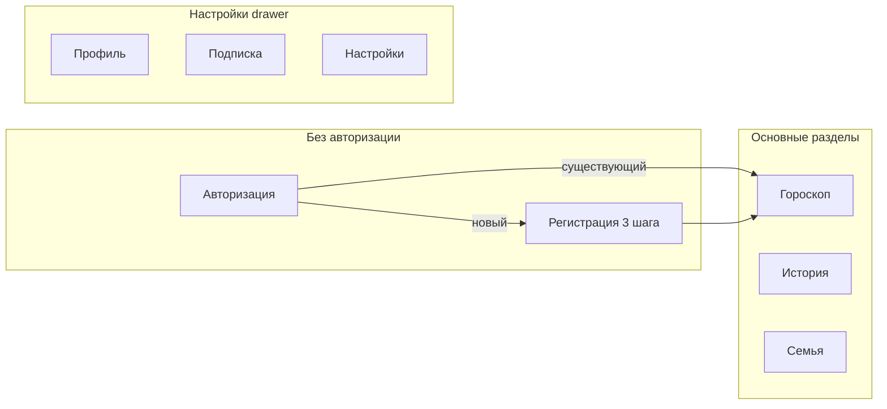
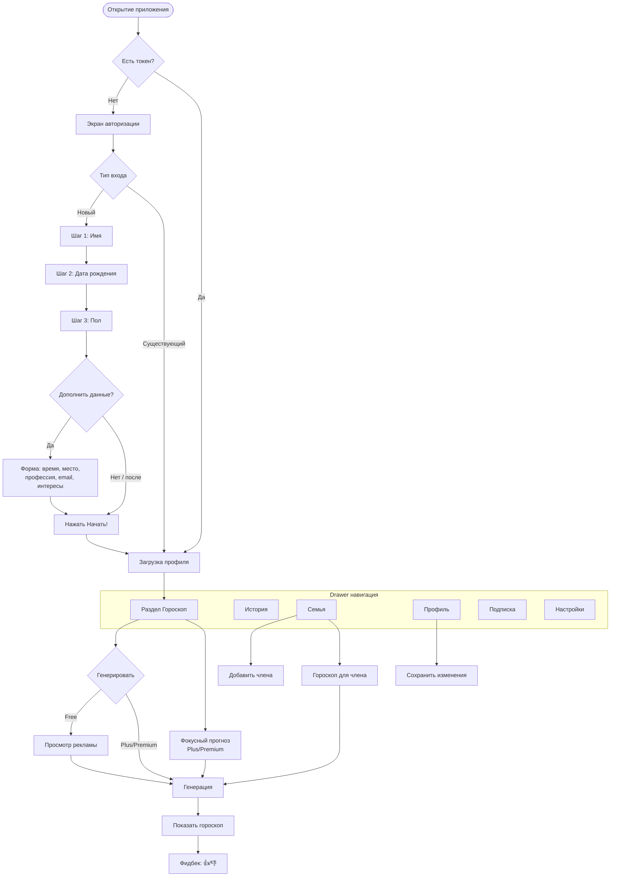

# MyAstro -- UI Макеты (Web SPA)

**Версия:** 0.2.0
**Обновлено:** 2026-04-28
**Тип интерфейса:** Адаптивный веб (SPA, max-width 520px)

**Стиль:** Мистический минимализм
**Палитра:** Темный фон (индиго #0f0f23 / карточки #1a1a2e / приподнятые #232342), акценты (золото #e2b714, фиолетовый #7b2ff7), текст (белый #f5f5f5, серый #8b8b9e)
**Шрифт:** System sans-serif (-apple-system, BlinkMacSystemFont, Segoe UI)

---

## Содержание

1. [Навигация и структура](#1-навигация-и-структура)
2. [Авторизация](#2-авторизация)
3. [Регистрация (онбординг)](#3-регистрация-онбординг)
4. [Гороскоп (главный экран)](#4-гороскоп-главный-экран)
5. [История](#5-история)
6. [Семья](#6-семья)
7. [Профиль](#7-профиль)
8. [Подписка](#8-подписка)
9. [Настройки](#9-настройки)
10. [Навигационная карта (User Flow)](#10-навигационная-карта)
11. [Дизайн-токены](#11-дизайн-токены)
12. [Use Cases (юзкейсы фронтенда)](#12-use-cases)

---

## 1. Навигация и структура

### 1.1 Верхний бар (Top Bar)

Фиксированный, всегда виден (кроме экранов авторизации/регистрации).

```
┌─────────────────────────────────┐
│ MYASTRO           ⭐  ☰         │
│ (золото, 3px)    (подписка)(меню)│
└─────────────────────────────────┘
```

- **MYASTRO** -- логотип, letter-spacing 3px, золотой цвет
- **Звезда** -- иконка подписки, ведет в раздел "Подписка"
- **Гамбургер** -- открывает правый drawer

### 1.2 Drawer (боковое меню справа)

```
┌──────────────────────────┐
│                    ✕     │
│                          │
│  РАЗДЕЛЫ                 │
│  🔮 Гороскоп       ←act │
│  📜 История              │
│  👨‍👩‍👧 Семья               │
│                          │
│  БУДУЩИЕ РАЗДЕЛЫ         │
│  🃏 Таро (скоро)    grey │
│  🛒 Магазин (скоро) grey │
│                          │
│  НАСТРОЙКИ               │
│  👤 Профиль и данные     │
│  ⭐ Подписка             │
│  ⚙ Настройки             │
│                          │
│  ┌──────────────────┐    │
│  │     Выйти        │    │
│  └──────────────────┘    │
└──────────────────────────┘
```

- Overlay затемняет фон при открытом drawer
- Активный раздел подсвечен золотым
- "Таро" и "Магазин" неактивны (серый текст, заглушки)
- Кнопка "Выйти" внизу drawer

### 1.3 Структура экранов



По умолчанию после входа открывается раздел **Гороскоп**.

---

## 2. Авторизация

```
┌─────────────────────────────┐
│                             │
│       ✨  ☆  ✨              │
│                             │
│      M Y A S T R O          │
│   Персональный AI-астролог  │
│                             │
│                             │
│  ┌─────────────────────┐    │
│  │  Войти (тестовый    │    │
│  │  режим)              │    │
│  └─────────────────────┘    │
│                             │
│  В продакшене:              │
│  Telegram / Google          │
│                             │
└─────────────────────────────┘
```

- Верхний бар скрыт на этом экране
- В тестовом режиме -- одна кнопка dev-login
- В продакшене: кнопки Telegram Login + Google Sign-In
- API: `POST /auth/telegram` или `POST /auth/google`

---

## 3. Регистрация (онбординг)

Трехшаговый онбординг для новых пользователей.

### 3.1 Шаг 1: Имя

```
┌─────────────────────────────┐
│                             │
│  Шаг 1 из 3                │
│                             │
│  Как тебя зовут?            │
│                             │
│  ┌─────────────────────┐    │
│  │ Введи имя...        │    │
│  └─────────────────────┘    │
│                             │
│  ┌─────────────────────┐    │
│  │     Далее →          │    │
│  └─────────────────────┘    │
│                             │
└─────────────────────────────┘
```

- Валидация: минимум 2 символа
- Кнопка "Далее" переключает на шаг 2

### 3.2 Шаг 2: Дата рождения

```
┌─────────────────────────────┐
│                             │
│  Шаг 2 из 3                │
│                             │
│  Когда ты родился(ась)?     │
│                             │
│  ┌─────────────────────┐    │
│  │  📅 дата рождения   │    │
│  └─────────────────────┘    │
│                             │
│       ♓ Рыбы               │
│  (появляется сразу при      │
│   выборе даты)              │
│                             │
│  ┌─────────────────────┐    │
│  │     Далее →          │    │
│  └─────────────────────┘    │
│                             │
└─────────────────────────────┘
```

- Нативный date picker
- Знак зодиака рассчитывается на клиенте мгновенно (функция `calcZodiac`)
- Валидация: дата обязательна

### 3.3 Шаг 3: Пол + дополнительные данные

```
┌─────────────────────────────┐
│                             │
│  Шаг 3 из 3                │
│                             │
│  Укажи пол                  │
│                             │
│  ┌──────────┐ ┌──────────┐  │
│  │ ♂ Мужской│ │ ♀ Женский│  │
│  └──────────┘ └──────────┘  │
│                             │
│  ┌─────────────────────┐    │
│  │   ✨ Начать!         │    │
│  └─────────────────────┘    │
│  ┌─────────────────────┐    │
│  │  ✏ Дополнить данные  │    │
│  └─────────────────────┘    │
│                             │
│  ┌─ Дополнительные ────┐    │
│  │ Время рождения [__] │    │
│  │ Место рождения [__] │    │
│  │ Профессия      [__] │    │
│  │ Email          [__] │    │
│  │                     │    │
│  │ Интересы:           │    │
│  │ [❤Любовь] [💼Карьер]│    │
│  │ [🏥Здоров] [💰Финан]│    │
│  │ ...                 │    │
│  │                     │    │
│  │ [Сохранить] [Отмена]│    │
│  └─────────────────────┘    │
│                             │
└─────────────────────────────┘
```

- **Только 2 варианта пола:** male / female (кнопка подсвечивается при выборе)
- Кнопка "Начать!" доступна сразу после выбора пола
- "Дополнить данные" раскрывает inline-форму с опциональными полями:
  - Время рождения (time input)
  - Место рождения (text)
  - **Профессия** (text, новое поле)
  - Email (email input)
  - Интересы из каталога (теги, toggle)
- "Сохранить" закрывает форму, "Отмена" скрывает без сохранения
- После "Начать!" -- `POST /auth/dev-login` (тест) или `/auth/telegram` (прод), затем `PATCH /profile/me` с допданными

---

## 4. Гороскоп (главный экран)

Раздел по умолчанию после входа.

### 4.1 До генерации

```
┌─────────────────────────────┐
│  MYASTRO           ⭐  ☰    │
│─────────────────────────────│
│                             │
│  ┌─────────────────────┐    │
│  │       ♓              │    │
│  │     Рыбы             │    │
│  │   28 апреля 2026     │    │
│  │     [FREE]           │    │
│  └─────────────────────┘    │
│                             │
│  ┌─────────────────────┐    │
│  │  🔮 Получить гороскоп│    │
│  └─────────────────────┘    │
│                             │
│  ┌─────────────────────┐    │
│  │ Заполни профиль для  │    │
│  │ точных прогнозов     │    │
│  │ ████████░░░░  60%    │    │
│  └─────────────────────┘    │
│                             │
└─────────────────────────────┘
```

- Карточка со знаком зодиака, именем знака, текущей датой и бейджем тарифа
- Кнопка генерации (золотой градиент)
- Карточка-подсказка profile completeness (скрывается при 100%)

### 4.2 После генерации

```
┌─────────────────────────────┐
│  MYASTRO           ⭐  ☰    │
│─────────────────────────────│
│                             │
│  ┌─────────────────────┐    │
│  │  ♓ Рыбы · FREE      │    │
│  └─────────────────────┘    │
│                             │
│  ┌─────────────────────┐    │
│  │ Общий     gpt-4o-mini│    │
│  │─────────────────────│    │
│  │ Дорогой Иван,       │    │
│  │ сегодня звезды      │    │
│  │ благоволят тебе в   │    │
│  │ сфере карьеры...    │    │
│  │                     │    │
│  │ Совет дня: доверься │    │
│  │ интуиции при        │    │
│  │ принятии решений.   │    │
│  └─────────────────────┘    │
│                             │
│  ┌──────┐    ┌──────┐       │
│  │ 👍   │    │ 👎   │       │
│  │Нравит│    │Не оч │       │
│  └──────┘    └──────┘       │
│                             │
│  🎯 Фокусный прогноз       │
│  [❤Любовь] [💼Карьера]      │
│  [🏥Здоровье] [💰Финансы]   │
│                             │
└─────────────────────────────┘
```

- Тип гороскопа и модель AI в шапке карточки
- Текст гороскопа с line-height 1.7
- Кнопки фидбека (блокируются после нажатия)
- Блок фокусных сфер (только для Plus/Premium)

### 4.3 Фокусный прогноз (Plus/Premium)

При нажатии на тег интереса запускается `POST /horoscope/generate` с `horoscope_type: "focused"` и `focus_interest_id`. Результат показывается в той же карточке.

Отображается лимит: "Осталось фокусных: N/день"

---

## 5. История

```
┌─────────────────────────────┐
│  MYASTRO           ⭐  ☰    │
│─────────────────────────────│
│                             │
│  📜 История                 │
│                             │
│  ┌─────────────────────┐    │
│  │ 🔮 2026-04-28   👍   │    │
│  │ Дорогой Иван,       │    │
│  │ сегодня звезды...   │    │
│  └─────────────────────┘    │
│  ┌─────────────────────┐    │
│  │ 🎯 2026-04-27   👎   │    │
│  │ В сфере отношений   │    │
│  │ сегодня стоит...    │    │
│  └─────────────────────┘    │
│  ┌─────────────────────┐    │
│  │ 🔮 2026-04-26        │    │
│  │ Рыбы сегодня могут  │    │
│  │ ощутить прилив...   │    │
│  └─────────────────────┘    │
│                             │
└─────────────────────────────┘
```

- Список последних гороскопов (глубина зависит от тарифа: 2/3/5)
- Каждая карточка: иконка типа (общий/фокусный), дата, бейдж фидбека
- Текст обрезается до 200 символов с "..."
- API: `GET /horoscope/history`
- Пустое состояние: "Пока нет гороскопов"

---

## 6. Семья

### 6.1 Список членов семьи

```
┌─────────────────────────────┐
│  MYASTRO           ⭐  ☰    │
│─────────────────────────────│
│                             │
│  👨‍👩‍👧 Семья                   │
│                             │
│  ┌─────────────────────┐    │
│  │ Мария                │    │
│  │ spouse · Рак · 1997  │    │
│  │ ┌─────────────┐      │    │
│  │ │🔮 Гороскоп  │      │    │
│  │ └─────────────┘      │    │
│  └─────────────────────┘    │
│                             │
│  ┌─────────────────────┐    │
│  │  + Добавить           │    │
│  └─────────────────────┘    │
│                             │
└─────────────────────────────┘
```

- Кнопка "+ Добавить" видна только для Plus/Premium (проверка через `GET /horoscope/limits`)
- Кнопка "Гороскоп" генерирует для конкретного члена семьи
- API: `GET /profile/family`, `POST /horoscope/generate {family_member_id}`

### 6.2 Форма добавления

```
┌─────────────────────────────┐
│  Новый член семьи           │
│                             │
│  ┌─────────────────────┐    │
│  │ Кто это?          ▼ │    │
│  └─────────────────────┘    │
│  ┌─────────────────────┐    │
│  │ Имя                 │    │
│  └─────────────────────┘    │
│  ┌─────────────────────┐    │
│  │ 📅 Дата рождения   │    │
│  └─────────────────────┘    │
│  ┌──────┐  ┌──────┐        │
│  │ ♂ М  │  │ ♀ Ж  │        │
│  └──────┘  └──────┘        │
│                             │
│  [Добавить]  [Отмена]       │
│                             │
└─────────────────────────────┘
```

- Select: Супруг(а), Ребенок, Родитель, Брат/Сестра, Партнер
- Пол: только male/female
- API: `POST /profile/family`

---

## 7. Профиль

```
┌─────────────────────────────┐
│  MYASTRO           ⭐  ☰    │
│─────────────────────────────│
│                             │
│  👤 Профиль                 │
│                             │
│  ┌─────────────────────┐    │
│  │       ♓              │    │
│  │      Иван            │    │
│  │      Рыбы            │    │
│  │   15.03.1995         │    │
│  └─────────────────────┘    │
│                             │
│  ┌─────────────────────┐    │
│  │  ✏ Данные            │    │
│  │                     │    │
│  │  Время рождения     │    │
│  │  ┌───────────────┐  │    │
│  │  │ 14:30         │  │    │
│  │  └───────────────┘  │    │
│  │  Место рождения     │    │
│  │  ┌───────────────┐  │    │
│  │  │ Москва        │  │    │
│  │  └───────────────┘  │    │
│  │  Профессия          │    │
│  │  ┌───────────────┐  │    │
│  │  │ Дизайнер      │  │    │
│  │  └───────────────┘  │    │
│  │  Email              │    │
│  │  ┌───────────────┐  │    │
│  │  │ ivan@mail.ru  │  │    │
│  │  └───────────────┘  │    │
│  │                     │    │
│  │  Интересы           │    │
│  │  [❤Любовь✓]         │    │
│  │  [💼Карьера✓]        │    │
│  │  [🏥Здоровье]        │    │
│  │  [💰Финансы]  ...    │    │
│  │                     │    │
│  │  ┌───────────────┐  │    │
│  │  │  Сохранить    │  │    │
│  │  └───────────────┘  │    │
│  └─────────────────────┘    │
│                             │
└─────────────────────────────┘
```

- Карточка-шапка: знак зодиака, имя, дата рождения (read-only из профиля)
- Редактируемые поля: время рождения, место, **профессия**, email
- Интересы из каталога (теги с toggle)
- API: `GET /profile/me` для загрузки, `PATCH /profile/me` для сохранения

---

## 8. Подписка

```
┌─────────────────────────────┐
│  MYASTRO           ⭐  ☰    │
│─────────────────────────────│
│                             │
│  ⭐ Подписка                │
│                             │
│  ┌─────────────────────┐    │
│  │ Free      бесплатно │    │
│  │ ─────────────────── │    │
│  │ ✗ С рекламой        │    │
│  │ Гороскопов/день: ∞  │    │
│  │ Фокус: 0/день       │    │
│  │ Семья: 0 чел.       │    │
│  │ История: 2 записи   │    │
│  └─────────────────────┘    │
│                             │
│  ┌─────────────────────┐    │
│  │ ⭐ Plus   149 ₽/мес │    │
│  │ ─────────────────── │    │
│  │ ✓ Без рекламы       │    │
│  │ Гороскопов/день: 3  │    │
│  │ Фокус: 1/день       │    │
│  │ Семья: 1 чел.       │    │
│  │ История: 3 записи   │    │
│  │ Год: 999 ₽ (-44%)   │    │
│  └─────────────────────┘    │
│                             │
│  ┌─────────────────────┐    │
│  │ 💎 Premium 299 ₽/мес│    │
│  │ ─────────────────── │    │
│  │ ✓ Без рекламы       │    │
│  │ Гороскопов/день: 6  │    │
│  │ Фокус: 2/день       │    │
│  │ Семья: до 5 чел.    │    │
│  │ История: 5 записей  │    │
│  │ Год: 1999 ₽ (-44%)  │    │
│  └─────────────────────┘    │
│                             │
└─────────────────────────────┘
```

- Данные загружаются из `GET /profile/tiers`
- Текущий тариф подсвечен
- Кнопки оплаты -- заглушки (MVP)

---

## 9. Настройки

```
┌─────────────────────────────┐
│  MYASTRO           ⭐  ☰    │
│─────────────────────────────│
│                             │
│  ⚙ Настройки               │
│                             │
│  ┌─────────────────────┐    │
│  │ 🔔 Уведомления  →   │    │
│  │ 🌓 Тема         →   │    │
│  │ 🌐 Язык         →   │    │
│  └─────────────────────┘    │
│                             │
│  ┌─────────────────────┐    │
│  │ Версия 0.1.0 (MVP)  │    │
│  │ Политика             │    │
│  │ конфиденциальности   │    │
│  └─────────────────────┘    │
│                             │
└─────────────────────────────┘
```

- Все пункты -- заглушки ("Скоро!")
- Уведомления, тема, язык -- планируются

---

## 10. Навигационная карта

### User Flow (Mermaid)



### Переходы между экранами

| Откуда | Куда | Триггер |
|---|---|---|
| Авторизация | Регистрация | Новый пользователь |
| Авторизация | Гороскоп | Существующий пользователь |
| Регистрация (шаг 3) | Гороскоп | Кнопка "Начать!" |
| Любой экран | Drawer | Иконка гамбургера |
| Drawer | Гороскоп | Пункт "Гороскоп" |
| Drawer | История | Пункт "История" |
| Drawer | Семья | Пункт "Семья" |
| Drawer | Профиль | Пункт "Профиль и данные" |
| Drawer | Подписка | Пункт "Подписка" |
| Drawer | Настройки | Пункт "Настройки" |
| Top bar | Подписка | Иконка звезды |
| Drawer | Авторизация | Кнопка "Выйти" |

---

## 11. Дизайн-токены

### Цвета

| Название | Hex | CSS-переменная | Использование |
|---|---|---|---|
| bg-primary | #0f0f23 | `--bg` | Основной фон |
| bg-card | #1a1a2e | `--card` | Карточки, drawer |
| bg-elevated | #232342 | `--elev` | Приподнятые элементы, инпуты |
| accent-gold | #e2b714 | `--gold` | CTA-кнопки, акценты, логотип |
| accent-purple | #7b2ff7 | `--purple` | Вторичные акценты, бордеры |
| accent-blue | #4361ee | `--blue` | Ссылки |
| text-primary | #f5f5f5 | `--txt` | Основной текст |
| text-secondary | #8b8b9e | `--txt2` | Вторичный текст, лейблы |
| success | #06d6a0 | `--ok` | "Нравится", успех |
| danger | #ef476f | `--err` | "Не нравится", ошибки |

### Скругления
- Кнопки: 12px
- Карточки: 16px
- Теги: 20px
- Аватар: 50% (круг)

### Тени
- Карточки: `0 4px 20px rgba(123, 47, 247, 0.1)`
- Свечение CTA: `0 0 20px rgba(226, 183, 20, 0.3)`

### Отступы
- Экранные padding: 16px по бокам
- Между элементами: 8-12px
- Внутри карточек: 16px
- Top bar высота: 52px
- Padding-top экранов: 60px (под top bar)

---

## 12. Use Cases (юзкейсы фронтенда)

### UC-01: Первый вход и регистрация

**Актор:** Новый пользователь
**Предусловие:** Пользователь открывает приложение впервые (нет токена в localStorage)
**Основной сценарий:**

1. Приложение проверяет наличие токена в `localStorage`
2. Токена нет -- показывается экран авторизации, top bar скрыт
3. Пользователь нажимает "Войти"
4. Показывается шаг 1 регистрации -- ввод имени
5. Пользователь вводит имя (мин. 2 символа), нажимает "Далее"
6. Показывается шаг 2 -- выбор даты рождения
7. При выборе даты знак зодиака рассчитывается на клиенте и отображается мгновенно
8. Пользователь нажимает "Далее"
9. Показывается шаг 3 -- выбор пола (male / female)
10. При выборе пола разблокируется кнопка "Начать!"
11. Пользователь нажимает "Начать!"
12. Фронт вызывает `POST /auth/dev-login`, получает JWT-токен, сохраняет в localStorage
13. Загружается профиль (`GET /profile/me`), каталог интересов (`GET /profile/options`)
14. Показывается раздел "Гороскоп", top bar становится видимым

**Альтернативный сценарий A: Дополнение данных при регистрации**

10a. После выбора пола пользователь нажимает "Дополнить данные"
10b. Раскрывается inline-форма: время рождения, место, профессия, email, интересы
10c. Пользователь заполняет нужные поля, выбирает интересы из каталога
10d. Нажимает "Сохранить" -- форма скрывается, toast "Данные сохранены"
10e. Пользователь нажимает "Начать!"
10f. После авторизации фронт вызывает `PATCH /profile/me` с дополнительными полями
10g. Продолжение с шага 13

**Альтернативный сценарий B: Отмена дополнения**

10a. Пользователь нажимает "Дополнить данные"
10b. Нажимает "Отмена" -- форма скрывается без сохранения
10c. Продолжение с шага 11

**Постусловие:** Пользователь авторизован, токен в localStorage, открыт раздел "Гороскоп"

---

### UC-02: Повторный вход

**Актор:** Существующий пользователь
**Предусловие:** Токен есть в localStorage

**Основной сценарий:**

1. Приложение находит токен в localStorage
2. Вызывает `GET /profile/me` для загрузки профиля
3. Вызывает `GET /profile/options` для каталога интересов
4. Показывает top bar и раздел "Гороскоп"

**Альтернативный сценарий: Токен невалиден**

2a. API возвращает 401 Unauthorized
2b. Токен удаляется из localStorage
2c. Показывается экран авторизации, top bar скрыт

---

### UC-03: Генерация общего гороскопа

**Актор:** Авторизованный пользователь
**Предусловие:** Пользователь на экране "Гороскоп"

**Основной сценарий:**

1. Пользователь нажимает "Получить гороскоп"
2. Кнопка блокируется, текст меняется на "Генерация..."
3. Фронт отправляет `POST /horoscope/generate {horoscope_type: "general"}`
4. API генерирует гороскоп, возвращает текст
5. Карточка результата становится видимой: тип, модель AI, текст гороскопа
6. Кнопки фидбека (like/dislike) активны
7. Кнопка генерации разблокируется, toast "Готово!"

**Альтернативный сценарий A: Нужна реклама (Free)**

3a. API возвращает 402 "Ad required"
3b. Фронт показывает ошибку через toast

**Альтернативный сценарий B: Лимит исчерпан**

3a. API возвращает 429 "Limit reached"
3b. Toast с сообщением об ошибке

**Постусловие:** Гороскоп отображен, доступен для оценки

---

### UC-04: Оценка гороскопа (фидбек)

**Актор:** Авторизованный пользователь
**Предусловие:** Гороскоп сгенерирован и отображен

**Основной сценарий:**

1. Пользователь нажимает "Нравится" или "Не нравится"
2. Фронт отправляет `POST /horoscope/{id}/feedback {feedback: "like"|"dislike"}`
3. Обе кнопки фидбека блокируются (повторная оценка невозможна)
4. Toast: "Спасибо!" (like) или "Учтем!" (dislike)

**Постусловие:** Фидбек сохранен, влияет на будущие генерации через AI-промпт

---

### UC-05: Генерация фокусного гороскопа (Plus/Premium)

**Актор:** Пользователь с подпиской Plus или Premium
**Предусловие:** Раздел "Гороскоп", блок фокусных сфер виден

**Основной сценарий:**

1. Фронт проверяет `GET /horoscope/limits` -- `focus_sphere_enabled: true`
2. Блок фокусных интересов отображается с тегами из каталога
3. Пользователь нажимает на тег (например, "Любовь")
4. Фронт отправляет `POST /horoscope/generate {horoscope_type: "focused", focus_interest_id: "love"}`
5. Результат отображается в карточке гороскопа с меткой "Фокусный (love)"

**Альтернативный сценарий: Free пользователь**

1a. `focus_sphere_enabled: false` -- блок фокусных сфер скрыт

---

### UC-06: Навигация через Drawer

**Актор:** Авторизованный пользователь
**Предусловие:** Любой экран основного приложения

**Основной сценарий:**

1. Пользователь нажимает иконку гамбургера в top bar
2. Появляется overlay (затемнение), drawer выезжает справа (анимация 0.3s)
3. Пользователь выбирает раздел (например, "История")
4. Drawer закрывается, все экраны скрываются, выбранный экран показывается
5. Активный пункт в drawer подсвечивается золотым
6. При необходимости загружаются данные раздела (history, family, profile, tiers)

**Альтернативный сценарий A: Закрытие без выбора**

3a. Пользователь нажимает на overlay или крестик
3b. Drawer закрывается, текущий экран остается

**Альтернативный сценарий B: Выход**

3a. Пользователь нажимает "Выйти"
3b. Токен удаляется из localStorage, профиль обнуляется
3c. Все экраны скрываются, показывается экран авторизации
3d. Top bar скрывается

---

### UC-07: Просмотр истории гороскопов

**Актор:** Авторизованный пользователь
**Предусловие:** Переход в раздел "История" через drawer

**Основной сценарий:**

1. Фронт вызывает `GET /horoscope/history`
2. Список гороскопов рендерится как карточки
3. Каждая карточка содержит: иконку типа (общий/фокусный), дату, бейдж фидбека, обрезанный текст (200 символов)

**Альтернативный сценарий: Пустая история**

2a. Массив `horoscopes` пуст
2b. Показывается заглушка "Пока нет гороскопов"

---

### UC-08: Управление семьей

**Актор:** Пользователь Plus/Premium
**Предусловие:** Раздел "Семья"

**Основной сценарий (просмотр):**

1. Фронт вызывает `GET /profile/family` и `GET /horoscope/limits`
2. Список членов отображается как карточки (имя, тип, знак зодиака, дата)
3. Кнопка "+ Добавить" видна, если `family_members_limit > 0`

**Сценарий добавления:**

4. Пользователь нажимает "+ Добавить"
5. Появляется inline-форма: тип родства (select), имя, дата, пол
6. Пользователь заполняет все поля
7. Нажимает "Добавить"
8. Фронт вызывает `POST /profile/family`
9. Форма скрывается, список обновляется, toast "Добавлен!"

**Сценарий генерации для члена:**

4. Пользователь нажимает "Гороскоп" на карточке члена семьи
5. Фронт вызывает `POST /horoscope/generate {family_member_id: "uuid"}`
6. Toast с превью результата

---

### UC-09: Редактирование профиля

**Актор:** Авторизованный пользователь
**Предусловие:** Раздел "Профиль"

**Основной сценарий:**

1. Фронт загружает данные из `profile` (кеш в памяти)
2. Карточка-шапка: знак зодиака, имя, дата (read-only)
3. Форма: время рождения, место, профессия, email (предзаполнены из профиля)
4. Теги интересов из каталога (выбранные подсвечены)
5. Пользователь меняет данные
6. Нажимает "Сохранить"
7. Фронт вызывает `PATCH /profile/me` с измененными полями
8. Профиль обновляется в кеше, экран перерисовывается, toast "Сохранено!"

**Результат:** Profile completeness пересчитывается на сервере. Новые данные (включая профессию) учитываются в следующем AI-промпте.

---

### UC-10: Просмотр тарифов

**Актор:** Авторизованный пользователь
**Предусловие:** Раздел "Подписка" (через drawer или иконку звезды)

**Основной сценарий:**

1. Фронт вызывает `GET /profile/tiers`
2. Тарифы рендерятся как карточки: название, цена, список фичей
3. Текущий тариф пользователя подсвечен

**Примечание:** Оплата -- заглушка в MVP.

---

### UC-11: Загрузка главного экрана (Гороскоп)

**Актор:** Система (при переходе в раздел)
**Триггер:** Переход в раздел "Гороскоп" через drawer или при старте

**Основной сценарий:**

1. Загрузка профиля (если не загружен): `GET /profile/me`
2. Отображение карточки: emoji знака, имя знака, дата, бейдж тарифа
3. Отображение completeness bar (скрыт при 100%)
4. Проверка текущего гороскопа: `GET /horoscope/today`
5. Если есть -- показать результат
6. Загрузка лимитов: `GET /horoscope/limits`
7. Если `focus_sphere_enabled` и каталог загружен -- показать блок фокусных сфер

---

### Диаграмма юзкейсов (Use Case Diagram)

```mermaid
graph TB
    subgraph Actors
        FREE[Free User]
        PLUS[Plus User]
        PREM[Premium User]
        ANON[Anonymous]
    end

    subgraph "Авторизация"
        UC_LOGIN[UC-01: Первый вход<br>и регистрация]
        UC_RELOGIN[UC-02: Повторный вход]
    end

    subgraph "Гороскоп"
        UC_GEN[UC-03: Генерация<br>общего гороскопа]
        UC_FB[UC-04: Оценка<br>гороскопа]
        UC_FOCUS[UC-05: Фокусный<br>гороскоп]
    end

    subgraph "Навигация"
        UC_NAV[UC-06: Навигация<br>через Drawer]
        UC_HIST[UC-07: Просмотр<br>истории]
    end

    subgraph "Семья и профиль"
        UC_FAM[UC-08: Управление<br>семьей]
        UC_PROF[UC-09: Редактирование<br>профиля]
    end

    subgraph "Подписка"
        UC_TIER[UC-10: Просмотр<br>тарифов]
    end

    ANON --> UC_LOGIN
    ANON --> UC_RELOGIN

    FREE --> UC_GEN
    FREE --> UC_FB
    FREE --> UC_NAV
    FREE --> UC_HIST
    FREE --> UC_PROF
    FREE --> UC_TIER

    PLUS --> UC_GEN
    PLUS --> UC_FB
    PLUS --> UC_FOCUS
    PLUS --> UC_NAV
    PLUS --> UC_HIST
    PLUS --> UC_FAM
    PLUS --> UC_PROF
    PLUS --> UC_TIER

    PREM --> UC_GEN
    PREM --> UC_FB
    PREM --> UC_FOCUS
    PREM --> UC_NAV
    PREM --> UC_HIST
    PREM --> UC_FAM
    PREM --> UC_PROF
    PREM --> UC_TIER
```



---

### Маппинг Use Cases на API

| Use Case | API Endpoints |
|---|---|
| UC-01: Первый вход | `POST /auth/dev-login`, `GET /profile/me`, `GET /profile/options`, `PATCH /profile/me` |
| UC-02: Повторный вход | `GET /profile/me`, `GET /profile/options` |
| UC-03: Генерация гороскопа | `POST /horoscope/generate` |
| UC-04: Оценка гороскопа | `POST /horoscope/{id}/feedback` |
| UC-05: Фокусный гороскоп | `GET /horoscope/limits`, `POST /horoscope/generate` |
| UC-06: Навигация | Нет прямых API-вызовов (клиентская логика) |
| UC-07: История | `GET /horoscope/history` |
| UC-08: Семья | `GET /profile/family`, `GET /horoscope/limits`, `GET /profile/options`, `POST /profile/family`, `POST /horoscope/generate` |
| UC-09: Профиль | `GET /profile/me`, `PATCH /profile/me` |
| UC-10: Тарифы | `GET /profile/tiers` |
| UC-11: Загрузка главного | `GET /profile/me`, `GET /horoscope/today`, `GET /horoscope/limits` |
